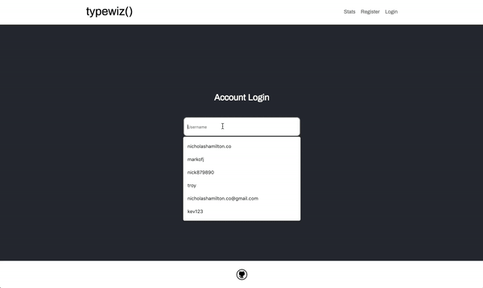

# Typing game built with Node.js, mongoose, vanilla, handlebars, passport, html, css

[Game live at ](https://typewiz.now.sh/) [https://typewiz.now.sh/](https://typewiz.now.sh/)



### Version
1.1.0

### Installation

Typewiz requires [Node.js](https://nodejs.org/) v4+ to run.

```sh
$ npm install
```

```sh
$ npm start
```

### Change mongo uri located in /config/keys.js 
Update mongoURI:''
